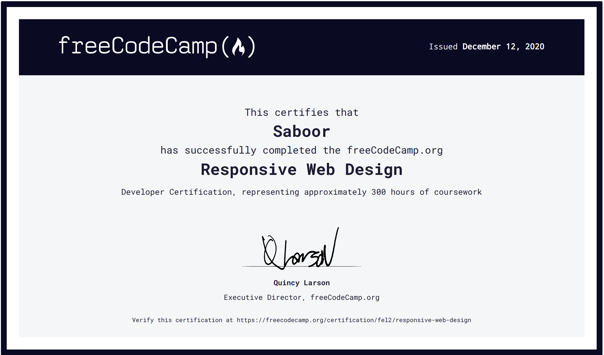
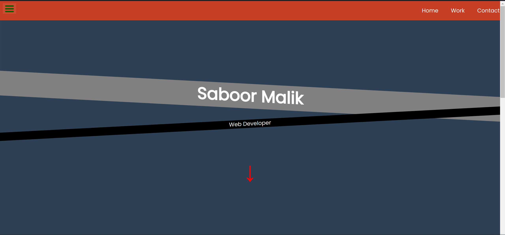

# FCC: Responsive Web Design Projects/Cert. (Source Code available on my CodePen).
# Certification :). https://www.freecodecamp.org/certification/fel2/responsive-web-design

# 1. Tribute Page

# 2. Survey Form

# 3. Product Landing Page

# 4. Technical Documentation Page

# 5. Personal Portfolio

